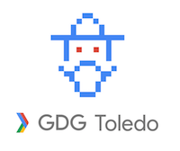

# GDG Toledo

## Identidad corporativa

Archivos fuente de la applicación sketch para identidad corporativa del grupo

## Tipografía

La tipografía del grupo es un proyecto opensource que se encuentra en GitHub [Hack](https://github.com/chrissimpkins/hack), bájatela e instalala antes de abrir tu archivo sketch.

## Google

Puedes ver mas correspondiente al branding en [GDG Google branding](https://developers.google.com/groups/logo/)

## Casos de uso

Nuestro logotipo es un logotipo responsive. 

### La reductibilidad permite leer bien la tipografía y el símbolo del GDG

En este caso aplicaremos el logotipo completo

### La reductibilidad no permite legibilidad para GDG Toledo

Es este caso se optará por poner sólo el simbolo

Suele ser este el caso mas frecuente en avatares, redes sociales o donde el logotipo deba trabajar en un formato cuadrado.